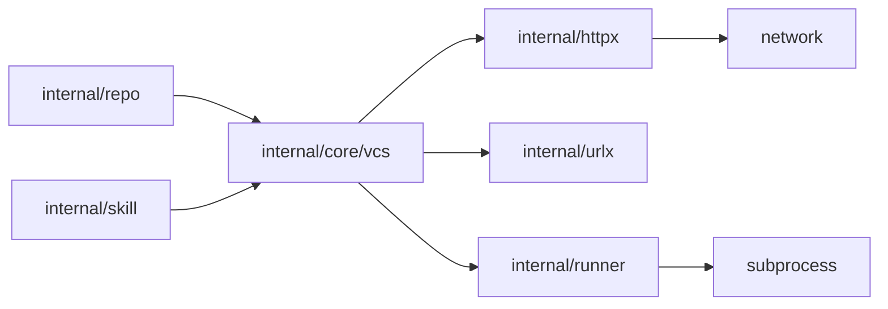
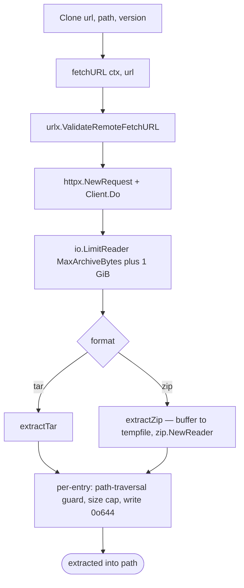

# `internal/core/vcs`

> Abstract VCS interface and the five backends that satisfy it: git
> (pure Go), hg / svn / bzr (subprocess), tar / zip (HTTP archive).

> **Pillar reference:** the full VCS pillar description lives in
> [`docs/core.md — VCS Sub-package`](../core.md#vcs-sub-package-internalcorevcs).
> This page focuses on package shape and recent fixes.

## Public API

| Symbol | Description |
|--------|-------------|
| `VCS` | Interface: `Clone(ctx, url, path, version)`, `Update(ctx, url, path, version)`, `IsCloned`, `CurrentVersion`, `HasChanges` |
| `New(vcsType string) (VCS, error)` | Factory by type string |
| `NewShallow(vcsType string) (VCS, error)` | Same, but git is `depth=1` (used for skill caches) |
| `DetectType(source string) string` | Auto-detect from URL or local path |
| `VcsGit`, `VcsMercurial`, `VcsSVN`, `VcsBazaar`, `VcsArchive` | Backend types |
| `RemoteURLMismatchError` | Typed error returned by `VcsGit.Update` when the working copy's `origin` URL disagrees with the configured URL (#220) |

### URL parameter on `Update`

`Update` accepts the configured URL alongside `path` and `version`. Today
only `VcsGit` consumes it: when non-empty, the backend reads `origin`'s
URL and returns a `*RemoteURLMismatchError` if it does not match. The
comparison strips scheme, credentials, trailing `.git`, and trailing
slashes; the host is lowercased while the path segment preserves case so
case-sensitive forges are handled correctly. Pass `""` to skip the
check — the skill manager does this for both local-path skills and
gaal-owned cache clones, because it owns the remote in the cache case
and cannot know the original URL in the local-path case.

## Backends

| Struct | Type | Strategy | Binary |
|--------|------|---------|--------|
| `VcsGit` | `git` | go-git, pure Go | none |
| `VcsMercurial` | `hg` | subprocess | `hg` |
| `VcsSVN` | `svn` | subprocess | `svn` + `svnversion` |
| `VcsBazaar` | `bzr` | subprocess | `bzr` |
| `VcsArchive` | `tar`, `zip` | HTTP fetch + stdlib extract | none |

## Dependency graph

`vcs` itself depends on:

- [`packages/urlx.md`](urlx.md) — pre-clone URL validation
- [`packages/httpx.md`](httpx.md) — archive fetch
- [`packages/runner.md`](runner.md) — subprocess wrapping (hg/svn/bzr)
- `go-git/go-git/v5` — git backend

## Archive extraction (`VcsArchive`)

Resource limits (in `archive.go`):

| Const | Value | Defends against |
|-------|-------|-----------------|
| `MaxArchiveBytes` | 1 GiB | Buffered/streamed body |
| `MaxFileBytes` | 256 MiB | gzip bombs |
| `MaxEntryCount` | 50 000 | Inode-exhaustion archives |

Path containment is enforced via `archiveEntryPath` — strips first
component, rejects absolute paths and `..` segments, then uses
`filepath.Rel` against the dest to catch separator tricks (PR for
#112).

## Subprocess backends

Every method that spawns a subprocess calls `requireBinary(name)` as
its **first statement** — surfaces a clear "tool missing from PATH"
error instead of a cryptic exec failure.

URL validation (PR for #117) and operand validation (PR for #116) run
before any subprocess invocation:

- `urlx.ValidateRepoURL` — scheme allowlist
- `validateVCSOperand("version", v)` — rejects leading-dash arguments
  that could be parsed as flags

Plus `--` separators are inserted before user-controlled positional
args so `hg`, `svn`, `bzr` cannot be tricked into interpreting them as
options.

## Recent fixes worth knowing

| PR | Issue | Effect |
|----|-------|--------|
| #117 | scheme allowlist | `ValidateRepoURL` enforces https/ssh/git + loopback-only http/svn/bzr |
| #116 | argv injection | `--` separator + operand validation across all subprocess backends |
| #220 | remote URL precedence | `VcsGit.Update` returns `*RemoteURLMismatchError` when the working copy's `origin` disagrees with the configured URL — `Update` signature gains a leading `url` parameter (other backends ignore it) |
| (open) #207 | partial-clone recovery | `VcsGit.IsCloned` validates HEAD; `Clone` stages + atomically swaps |
| (open) #206 | archive update | `VcsArchive.Update` re-fetches and atomically replaces; interface gains `url` parameter |

(Open PRs are noted as such — main does not yet carry their behaviour.)

## Related

- [`docs/core.md`](../core.md) — full pillar description
- [`packages/repo.md`](repo.md), [`packages/skill.md`](skill.md) — main consumers
