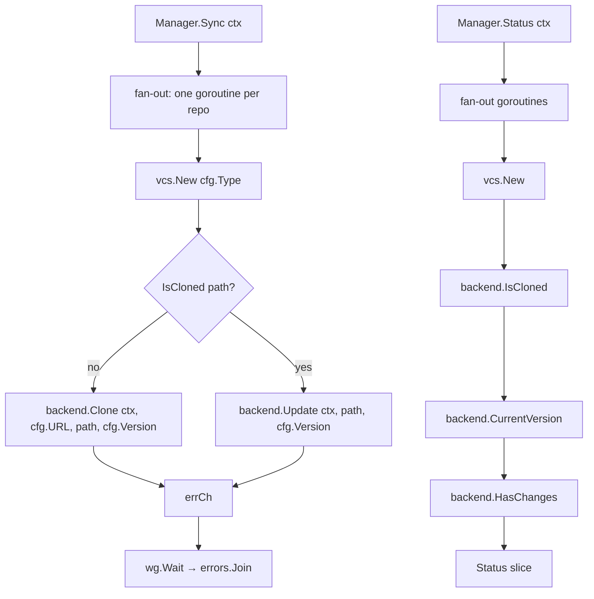

# `internal/repo`

> Repository manager. Drives `internal/core/vcs` backends in parallel,
> one goroutine per `repositories:` entry.

## Public API

| Symbol | Description |
|--------|-------------|
| `NewManager(repos map[string]ConfigRepo, stateDir string) *Manager` | Construct |
| `Manager.Sync(ctx) error` | Clone-or-update every repo; errors aggregated with `errors.Join` |
| `Manager.Status(ctx) []Status` | Per-repo status (`Cloned`, `Dirty`, `Current`, `Err`) |
| `Status` | Shape: `Path`, `Type`, `URL`, `Version`, `Current`, `Cloned`, `Dirty`, `Err` |

## Flow

## Backend selection

| `cfg.Type` | Backend | Notes |
|-----------|---------|-------|
| `git` | `VcsGit` (full clone) | go-git, pure Go |
| `hg` | `VcsMercurial` | subprocess, requires `hg` |
| `svn` | `VcsSVN` | subprocess, requires `svn` + `svnversion` |
| `bzr` | `VcsBazaar` | subprocess, requires `bzr` |
| `tar`, `zip` | `VcsArchive` | HTTP fetch + stdlib extract |

`Manager` itself never picks shallow mode — that's reserved for
`internal/skill` (which keeps a depth-1 cache). Repos defined under
`repositories:` always get full history (or full archive expansion)
because the user typically wants to use them as live source trees.

## Why parallel?

Repos are independent: each one has its own remote, its own version,
its own destination path. Sequencing them serially would make a
multi-repo sync wall-clock-bound by the slowest network roundtrip.
The fan-out is bounded only by `len(repos)` — there is no goroutine
pool today, by design (most users have a handful of repos, not
hundreds).

## Errors

A single repo failure (network drop, auth error, broken VCS state)
does **not** abort the rest of the sync. All goroutines run to
completion; errors are collected via the buffered channel and joined
via `errors.Join`. The caller (`engine.RunOnce`) surfaces the joined
error to the user along with the partial-success summary.

### `RemoteURLMismatchError` (git only)

When `repositories.<path>` points at an existing git working copy whose
`origin` URL disagrees with `url:` in `gaal.yaml`, `VcsGit.Update`
returns a typed `*vcs.RemoteURLMismatchError` **before** any fetch — so
the user gets a precedence message instead of a leaked SSH-agent or
HTTPS-auth error. Manager wraps with
`fmt.Errorf("repo %q: %w", path, err)`; `errors.As` still matches the
typed error through the wrap. See
[Repositories: remote URL precedence](../config.md#repositories-remote-url-precedence).

## Related

- [`packages/core-vcs.md`](core-vcs.md) — backends.
- [`commands/sync.md`](../commands/sync.md) — main consumer.
- [`packages/discover.md`](discover.md) — how `Status` is used to
  detect drift in `gaal status`.
