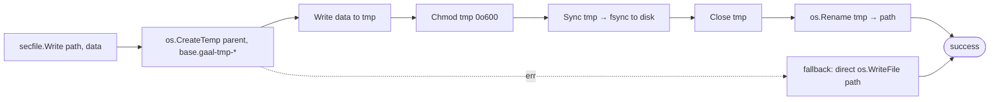

# `internal/core/io/secfile`

> Atomic 0o600 file writes for anything that may hold secrets — MCP env
> tokens, telemetry state, log records, gaal config.

## Public API

| Symbol | Description |
|--------|-------------|
| `Mode os.FileMode = 0o600` | Permission bits applied to all writes |
| `Write(path string, data []byte) error` | Atomic write: temp file in same dir → fsync → rename → chmod 0o600 |
| `OpenAppend(path string) (*os.File, error)` | Open for append-write with 0o600; tightens existing files via Chmod |

## Why atomic?

`os.WriteFile` truncates the destination first. A crash mid-write leaves
a half-written file the next read will treat as authoritative — and for
JSON / TOML configs, that means the agent stops working until the user
investigates.

PR #202 (#120) made `Write` atomic via the temp-file + `os.Rename`
pattern that POSIX guarantees as atomic on the same filesystem:

The fallback to direct `WriteFile` happens only when the temp file
cannot be created in the destination's parent (e.g. read-only or
permission denied). This is logged via `slog.Warn` so the user can
investigate, but the write still completes — old behaviour, just not
atomic.

## Why `0o600`?

Configuration files written by gaal can contain:

- MCP server `env` blocks holding API tokens.
- Telemetry state (consent and machine ID).
- Log records that may include URLs or paths the user considers
  sensitive (PR for #114 redacts credentials, but path-leak is still
  conceivable).

Tightening to owner-read/write closes the surprise where a previously-
created `0o644` config file stays world-readable forever even after
gaal updates it. PR #115 wired in the `Chmod` step to tighten existing
files on every write.

## Consumers

| Caller | Why |
|--------|-----|
| `internal/mcp/codec.go` | Atomic upsert of agent JSON / TOML config files |
| `internal/engine/ops/init.go` | First-time write of `gaal.yaml` (also for `--force` backups) |
| `internal/telemetry` | Append-write for the telemetry log + state file |
| `internal/logger` | Log file (`--log-file`) |

## Tests

- Round-trip a write and read it back.
- Chmod tightening verified by `Stat().Mode()` after a `0o644` rewrite.
- Fallback path covered by setting the parent directory unwritable
  before the call (Linux only).

## Related

- [`commands/sync.md`](../commands/sync.md) — every write the sync
  performs goes through this package.
